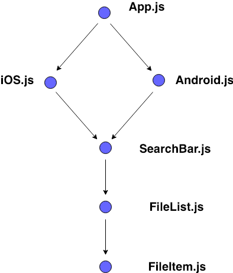
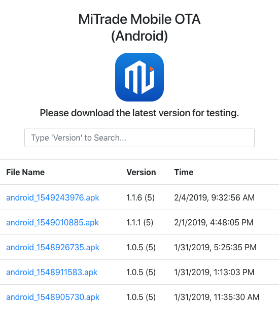
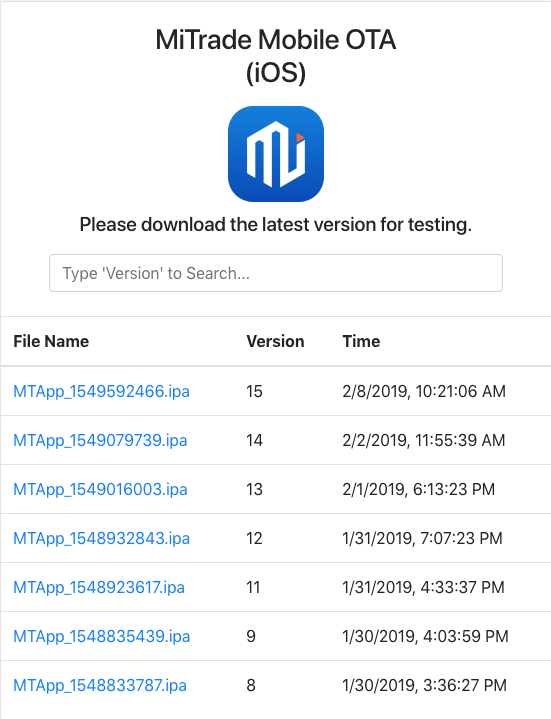

## OTA-Web Architechure 
### Introduction
Mobile OTA (Over-The-Air) update is an application distribution method which delivers test application prior to public launch process. We are required to set the frontend and backend service to connect with the development pipline process.

### Architecture
This project is run on reactJS environment. It consists of two main pages (Android and iOS) with five components, with the usage of APIs provided by [OTA-Server](https://github.com/sunnytse0326/Mobile-OTA-Server). 
<br>
<br>
The following tree diagram briefly explain component hierarchy of the application:
<br>
<br>

<br>
<br>
### Components Design
In the project, [react-router-dom](https://github.com/ReactTraining/react-router/tree/master/packages/react-router-dom) is simply used for redirecting pages from the domain path with following components:
- ```Android.js``` : Core of Android main page
- ```iOS.js``` : Core of iOS main page
- ```SearchBar.js``` : Component for filtering files from list by keywords
- ```FileList.js``` : Component contain file list cells
- ```FileItem.js``` : Component to represent each file

Android             |  iOS
:-------------------------:|:-------------------------:
  |  
